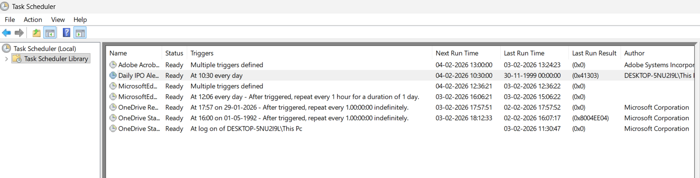
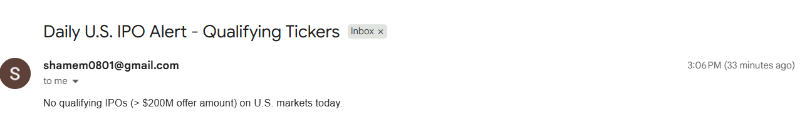

# Why This Approach: Cost-Effective IPO Alert

## The Problem

I needed daily IPO alerts for U.S. markets (qualifying tickers with offer size > $200M). Automation tools like **Make.com** and **n8n** can do this, but they come with a cost.

## Cost Comparison

| Approach | Cost | Notes |
|----------|------|-------|
| **Make.com** | Paid plans for reliable scheduling | Free tier has limits; paid plans add up |
| **n8n** | Self-hosted free, cloud paid | Cloud hosting = recurring cost |
| **This script + Task Scheduler** | **$0** | Runs on your machine, no recurring fees |

After comparing options, I chose the simple script + Windows Task Scheduler approach: **free, self-hosted, and fully under my control**.

## What I Built

A Python script that:

- Fetches IPO data from Finnhub (free API)
- Filters U.S. IPOs with offer size > $200M
- Sends a daily email with qualifying tickers (or a clean message when none qualify)
- Runs via **Windows Task Scheduler** (or cron on Linux/Mac) — no cloud automation needed

## Task Scheduler Setup

The script is scheduled to run daily at 10:30 AM. Here's how it appears in Task Scheduler:

**Task details:**
- **Name:** Daily IPO Alert
- **Trigger:** At 10:30 every day
- **Status:** Ready
- **Next run:** Runs as scheduled

## Sample Email Output

When the script runs, it sends an email with qualifying tickers — or a clear message when there are none:

**Subject:** Daily U.S. IPO Alert - Qualifying Tickers  
**Content:** Neat, formatted message with qualifying tickers or a clear "no qualifying IPOs today" notice.

## Summary

> **Make.com and n8n** — powerful but add cost.  
> **This script + Task Scheduler** — same outcome, zero recurring cost, works anywhere you can run Python and schedule a task.
